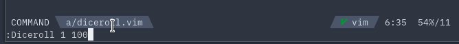

# diceroll.vim
__Need to check *Sanity values* after seeing a huge number of error logs? diceroll.vim can help.__


## Instration
Packer
```vim
use 'Allianaab2m/diceroll.vim'
```

vim-plug
```vim
Plug 'Allianaab2m/diceroll.vim'
```

## Usage
Just Type,
```vim
:Diceroll [times] [dice]
```

example:
```vim
:Diceroll 1 100 <-- 1d100
:Diceroll 3 6   <-- 3d6
```

## Feature
- Powerline component
- `n+[time]D[dice]` Type dice
  - ex): 2+1D6 => [3, 4, 5, 6, 7, 8]
