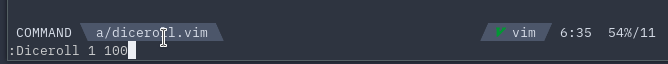

# diceroll.vim
__大量のエラーログを見て SAN 値チェックが必要？diceroll.vim にお任せください。__


## インストール
Packer
```vim
use 'Allianaab2m/diceroll.vim'
```

vim-plug
```vim
Plug 'Allianaab2m/diceroll.vim'
```

## 使い方
使い方は至って簡単です。
```vim
:Diceroll [times] [dice]
```

例:
```vim
:Diceroll 1 100 <-- 1d100
:Diceroll 3 6   <-- 3d6
```

## 追加予定の機能
- Powerline のコンポーネント
- `n+[time]D[dice]`式のダイスロール(なんて言うんだろう)
  - ex): 2+1D6 => [3, 4, 5, 6, 7, 8] のうちどれか
